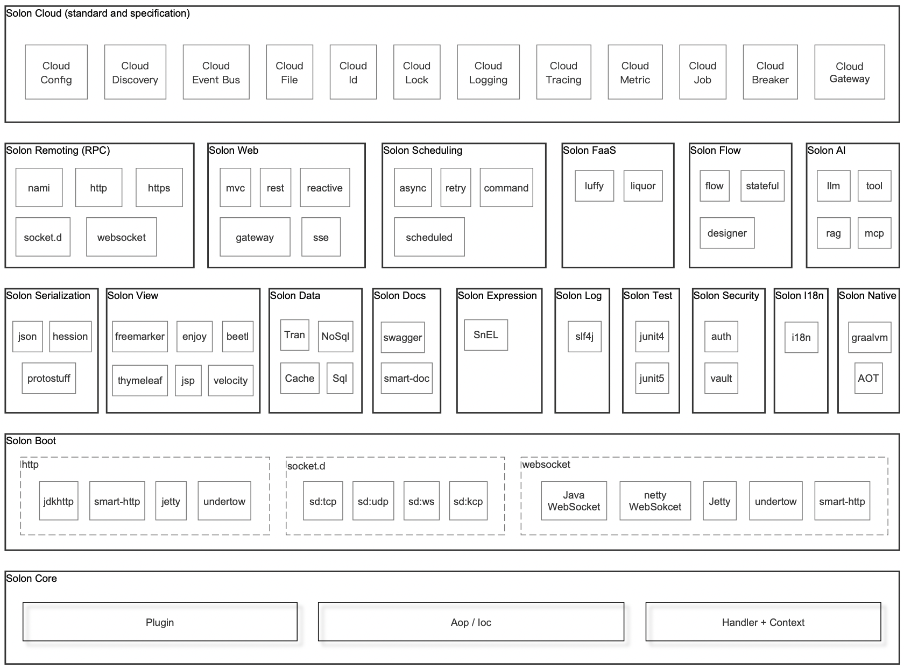
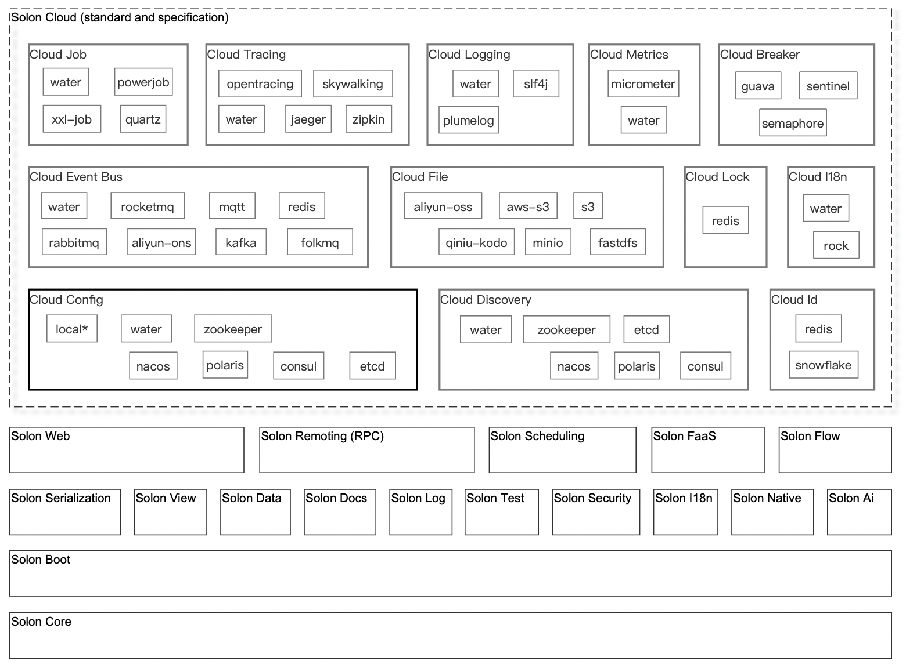

<h1 align="center" style="text-align:center;">

 
JustSimple
</h1>

	<strong>Структура разработки приложений на бизнес-уровне, ориентированная на полную сцену</strong>
     
    <strong>сдержанность, эффективность, открытость</strong>

	<a href="https://github.com/Mutantcat-Working-Group/JustSimple/">https://github.com/Mutantcat-Working-Group/JustSimple</a>

    
    
    
    
    
    
    
     
    

##### язык： Русский | [中文](README_CN.md)  | [English](README_EN.md) | [日本語](README_JP.md)

На 700% выше; 50% памяти; Запуск в 10 раз быстрее; Упакуйте на 90% меньше; Поддерживает java8 - java26 в то же время, когда нейтив работает.
 
Построенный с нуля, с более гибкими нормами интерфейса и открытой экологией

## функц:

| функц                                                      | описыва                                                                                                                 | 
|------------------------------------------------------------|-------------------------------------------------------------------------------------------------------------------------| 
| Более высокое соотношение вычислительных ресурсов к цене   | На 700% выше([techempower](https://www.techempower.com/benchmarks/#hw=ph&test=plaintext&section=data-r23)); 50% памяти. |
| Более быстрое развитие                                     | Мало кодов; Начало простое. Запуск в 10 раз быстрее.                                                                    |
| Лучший опыт производства и развертывания                   | На 90% меньше.                                                                                                          |
| Более широкий диапазон совместимости                       | Архитектура не java-ee; Поддерживает java8 - java26, graalvm native image                                               |

## Основной кодовый склад

| Кодовый склад                                                               | описыва                                                         | 
|-----------------------------------------------------------------------------|-----------------------------------------------------------------| 
| [/Mutantcat-Working-Group/justsimple](../../../../Mutantcat-Working-Group/justsimple)                             | JustSimple ,Главный код пакгауза                                     | 
| [/Mutantcat-Working-Group/justsimple-examples](../../../../Mutantcat-Working-Group/justsimple-examples)           | JustSimple ,Стандартный набор кодов на официальном сайте             |
|                                                                             |                                                                 |
| [/Mutantcat-Working-Group/justsimple-ai](../../../../Mutantcat-Working-Group/justsimple-ai)                       | JustSimple Ai ,Кодовый склад                                         | 
| [/Mutantcat-Working-Group/justsimple-flow](../../../../Mutantcat-Working-Group/justsimple-flow)                   | JustSimple Flow ,Кодовый склад                                       | 
| [/Mutantcat-Working-Group/justsimple-expression](../../../../Mutantcat-Working-Group/justsimple-expression)       | JustSimple Expression ,Кодовый склад                                 | 
| [/Mutantcat-Working-Group/justsimple-cloud](../../../../Mutantcat-Working-Group/justsimple-cloud)                 | JustSimple Cloud ,Кодовый склад                                      | 
| [/Mutantcat-Working-Group/justsimple-admin](../../../../Mutantcat-Working-Group/justsimple-admin)                 | JustSimple Admin ,Кодовый склад                                      | 
| [/Mutantcat-Working-Group/justsimple-integration](../../../../Mutantcat-Working-Group/justsimple-integration)     | JustSimple Integration ,Кодовый склад                                | 
| [/Mutantcat-Working-Group/justsimple-java17](../../../../Mutantcat-Working-Group/justsimple-java17)               | JustSimple Java17 ,Кодовый склад（base java17）                        | 
| [/Mutantcat-Working-Group/justsimple-java25](../../../../Mutantcat-Working-Group/justsimple-java25)               | JustSimple Java25 ,Кодовый склад（base java25）                        | 
|                                                                             |                                                                 |
| [/Mutantcat-Working-Group/justsimplecode](../../../../Mutantcat-Working-Group/justsimplecode)                     | JustSimpleCode(Java8 impl version of "Claude Code") ,Code repository |
| [/Mutantcat-Working-Group/justsimpleclaw](../../../../Mutantcat-Working-Group/justsimpleclaw)                     | JustSimpleClaw(Java8 impl version of "OpenClaw") ,Code repository    | 
|                                                                             |                                                                 |
| [/Mutantcat-Working-Group/justsimple-maven-plugin](../../../../Mutantcat-Working-Group/justsimple-gradle-plugin) | JustSimple Maven ,Код плагина хранилища                              | 
| [/Mutantcat-Working-Group/justsimple-gradle-plugin](../../../../Mutantcat-Working-Group/justsimple-gradle-plugin) | JustSimple Gradle ,Код плагина хранилища                             | 
|                                                                             |                                                                 |
| [/Mutantcat-Working-Group/justsimple-idea-plugin](../../../../Mutantcat-Working-Group/justsimple-idea-plugin)     | JustSimple Idea ,Код плагина хранилища                               | 
| [/Mutantcat-Working-Group/justsimple-vscode-plugin](../../../../Mutantcat-Working-Group/justsimple-vscode-plugin) | JustSimple VsCode ,Код плагина хранилища                             | 

## Экологическая архитектура：

* justsimple

* justsimple cloud

## Официальная сеть и связанные с ней примеры, дела：

* Адрес основной сети：[https://github.com/Mutantcat-Working-Group/JustSimple](https://github.com/Mutantcat-Working-Group/JustSimple)
* Монометрия проекта：[__test](./__test/) 
* Дело пользователя：[Пользовательский проект с открытым исходным кодом](https://github.com/Mutantcat-Working-Group/JustSimple/article/555)、[Коммерческий проект пользователя](https://github.com/Mutantcat-Working-Group/JustSimple/article/cases)

## Особая благодарность JetBrains за поддержку проекта open source：

